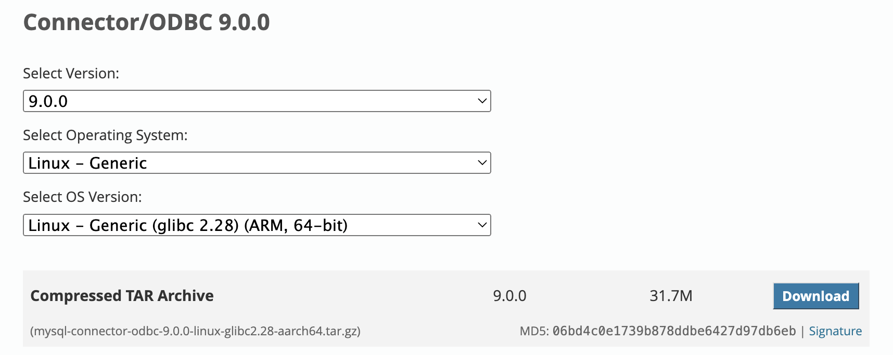

## 数据库管理系统测试报告

### 1. 引言

本报告旨在对两种流行的数据库管理系统——MySQL 和 PostgreSQL 进行分析与比较，重点关注它们在事务处理中的一致性表现。通过使用 3TS Coo 一致性检查工具，我们将对这两款数据库在不同隔离级别下的行为进行测试，揭示它们在处理并发事务时的优缺点。

我们首先简要介绍数据库管理系统的基本概念和功能特点，随后阐述 MySQL 和 PostgreSQL 的特点。接着，我们介绍 3TS Coo 工具的功能及其在一致性检查中的应用。然后我们进行环境配置、测试方法及结果分析，最后总结测试发现并提出对不同数据库管理系统的建议。

### 2. 背景知识

#### 2.1 数据库管理系统概述

数据库管理系统（DBMS）是用于创建、管理和操作数据库的软件。它们提供了一系列功能和特点，主要包括：

- **数据存储与管理**：提供有效的数据存储机制，让用户可以方便地插入、更新、删除和查询数据。
- **数据安全**：通过用户权限管理和加密等措施，保证数据的安全性。
- **数据完整性**：通过主键、外键、唯一约束等机制，保证数据的一致性和完整性。
- **事务管理**：支持原子性、一致性、隔离性和持久性（ACID）原则，确保事务处理的可靠性。
- **并发控制**：支持多个用户同时访问和操作数据库，实现并发控制。
- **备份与恢复**：提供数据库备份和恢复功能，以保护数据免受灾难性损失。

#### 2.2 选择的数据库系统的特点

##### MySQL

- **高性能**：MySQL 以其高速的读写性能著称，特别适合需要快速响应的 Web 应用场景。
- **广泛支持**：由于其易用性和稳定性，MySQL 在各种操作系统（如 Linux、Windows 和 macOS）上都得到了广泛支持。
- **灵活扩展**：支持丰富的存储引擎，不同的存储引擎提供了不同的功能，适应不同的应用需求。
- **大量文档**：拥有丰富的文档和教程，帮助用户快速上手和解决问题。
- **分布式架构**：支持主从复制和分片技术，提供高可用性和扩展性。

##### PostgreSQL

- **数据完整性**：通过高级的锁定机制和多版本并发控制（MVCC），确保数据的一致性和可靠性。
- **复杂查询优化**：支持复杂的 SQL 查询、窗口函数和递归查询，适用于需要高级数据处理的企业应用。
- **高度标准兼容**：完全支持 SQL 标准，提供健全的事务处理和数据完整性保障。
- **灵活性和扩展性**：允许用户自定义数据类型、索引和操作符，并支持丰富的扩展模块如 PostGIS、JSONB 等。
- **开放社区支持**：由全球活跃的开源社区维护，持续发布新功能和改进。

#### 2.3 3TS Coo 一致性检查工具

3TS Coo 是一个用于事务数据库的一致性检查工具。其特点包括：

- **准确性**：能够识别所有类型的异常。
- **用户友好性**：基于 SQL 的测试，易于使用。
- **经济高效性**：能够在几分钟内完成一次检查。

3TS Coo 通过检测数据库在不同隔离级别下的行为，识别异常与一致性问题。结果行为分为两类：

1. **异常（Anomaly）**：数据库无法识别数据异常，导致数据不一致。
2. **一致性（Consistency）**：数据库通过具有可序列化结果的异常测试用例（无 POP 周期），确保数据保持一致性。

3TS Coo 支持以下隔离级别：

- **可序列化（SER）**
- **可重复读取（RR）**
- **已提交读取（RC）**
- **未提交读取（RU）**
- **快照隔离（SI）** 

### 3. 环境配置

#### 3.1 硬件环境

- 操作系统: macOS Monterey 12.7.1
- CPU: Apple M1
- 内存: 16 GB RAM
- 存储: 1T SSD

#### 3.2 软件环境

- 数据库管理系统: 
  - MySQL 8.0.39
  - PostgreSQL 12.20
- 虚拟机: 
  - Ubuntu 20.04 ARM

#### 3.3 安装步骤

##### 步骤1：安装编译环境

```bash
sudo apt install build-essential cmake
```

##### 步骤2：安装 unixODBC

在终端中执行以下命令安装 unixODBC：

```bash
sudo apt update
sudo apt install unixodbc unixodbc-dev
odbcinst -j  # 检验安装是否成功
```

##### 步骤3：下载 ODBC 驱动

访问 MySQL 官网，下载相应版本的 MySQL ODBC 驱动。



在终端中执行以下命令安装 odbc-postgresql：

```bash
sudo apt install odbc-postgresql
```

##### 步骤4：安装 MySQL ODBC 驱动

根据 MySQL ODBC 安装教程，在终端中执行命令安装 MySQL ODBC 驱动。

安装成功后，查看 `/etc/odbcinst.ini` 文件，会看到如下驱动，说明安装成功：

```ini
[MySQL ODBC 9.0 Unicode Driver]
DRIVER=/usr/local/lib/libmyodbc9w.so
UsageCount=1

[MySQL ODBC 9.0 ANSI Driver]
DRIVER=/usr/local/lib/libmyodbc9a.so
UsageCount=1

[PostgreSQL ANSI]
Description=PostgreSQL ODBC driver (ANSI version)
Driver=psqlodbca.so
Setup=libodbcpsqlS.so
Debug=0
CommLog=1
UsageCount=1

[PostgreSQL Unicode]
Description=PostgreSQL ODBC driver (Unicode version)
Driver=psqlodbcw.so
Setup=libodbcpsqlS.so
Debug=0
CommLog=1
UsageCount=1
```

##### 步骤5：配置 ODBC 数据源

编辑 `/etc/odbc.ini` 文件，添加以下内容：

```ini
[mysql]
Description = MySQL ODBC Data Source
Driver = MySQL ODBC 9.0 Unicode Driver
Server = localhost
User = your_username
Password = your_password
Database = your_database_name
Port = 3306

[pg]
Description = My PostgreSQL Database
Driver = PostgreSQL Unicode
Servername = localhost
Username = your_username
Password = your_password
Port = 5432
```

##### 步骤6：测试连接

使用 `isql` 命令测试连接：

```bash
koschei@tardis:~$ isql -v mysql
+---------------------------------------+
| Connected!                            |
|                                       |
| sql-statement                         |
| help [tablename]                      |
| quit                                  |
|                                       |
+---------------------------------------+
SQL>
koschei@tardis:~$ isql -v pg
+---------------------------------------+
| Connected!                            |
|                                       |
| sql-statement                         |
| help [tablename]                      |
| quit                                  |
|                                       |
+---------------------------------------+
SQL>
```

### 4. 运行方法

#### 4.1 编译源代码

在 `3TS/src/dbtest` 目录下执行以下命令编译 3TS Coo：

```bash
cmake -S ./
make
```

#### 4.2 执行测试

`auto_test.sh` 是一个数据库测试工具的调用脚本。它根据传入的数据库类型和隔离级别参数，执行相应的数据库测试。选择需要测试的数据库，并填写正确的数据库连接信息（例如：**-user** 和 **-passwd**）。

`auto_test_all.sh` 是一个用于自动化测试不同数据库隔离级别的脚本。它通过调用 `auto_test.sh`，对多种数据库类型和隔离级别进行测试。我们可以注释掉不需要执行的测试命令，然后执行 `auto_test_all.sh` 脚本。

```bash
./auto_test_all.sh
```

### 5. 测试 MySQL 与 PostgreSQL

#### 5.1 测试结果

执行 `3TS Coo` 程序对两款数据库进行测试，并对产生的每个数据库文件夹下的 `result_summary` 文件夹内各个隔离级别的结果通过 `3TS_summary.py` 脚本进行处理，得到 `transaction_summary.xlsx` 表格文件。

#### 5.2 测试结果分析

对 `transaction_summary.xlsx` 表格文件进行分析可得：

1. **总体比较**：
   - MySQL 和 PostgreSQL 在大多数测试用例中表现相似，但也存在一些显著差异。
   - PostgreSQL 在某些情况下比 MySQL 提供更强的隔离保证，特别是在 Repeatable Read 和 Serializable 级别。

2. **各隔离级别的比较**：

   a) **Read Uncommitted**：
   - 两者都允许大多数异常发生，这符合预期，因为这是最低的隔离级别。
   - 由于 PostgreSQL 将 Read Uncommitted 隔离级别视为 Read Committed，比 MySQL 发生了更少的异常，在这个级别下表现基本相同。

   b) **Read Committed**：
   - 两个数据库在这个级别的表现完全相同，且大多数测试用例都显示为 "Anomaly"，符合预期。
   - PostgreSQL 将 Read Uncommitted 隔离级别视为 Read Committed，表现与 Read Uncommitted 相同。

   c) **Repeatable Read**：
   - 这个级别开始出现显著差异，PostgreSQL 在多个测试中表现出 "Rollback"，而 MySQL 仍然显示 "Anomaly"，例如测例 `iat_dda_read_write_skew1_committed` 和 `iat_sda_lost_update_committed` 等。

   d) **Serializable**：
   - 在这个级别下，两者表现更加接近，大多数测试用例都显示为 "Rollback" 或 "Pass"。
   - PostgreSQL 在一些情况下显示 "Pass"，而 MySQL 显示 "Rollback"。

3. **主要差异分析**：

   a) **Repeatable Read 级别**：
   - PostgreSQL 的实现比 MySQL 更严格，提供了更强的隔离保证。
   - PostgreSQL 在这个级别下能够防止更多的并发异常，如某些写偏差（write skew）和丢失更新（lost update）。

   b) **Serializable 级别**：
   - 虽然两者都提供了强的一致性保证，但实现方式不同。
   - MySQL 使用基于锁的方法，倾向于在冲突时回滚事务。
   - PostgreSQL 使用可序列化快照隔离（SSI），在某些情况下可以允许并发操作而不需要回滚。

4. **原因分析**：

   a) **实现机制不同**：
   - MySQL 主要使用锁机制来实现隔离。
   - PostgreSQL 使用多版本并发控制（MVCC）和快照隔离技术。

   b) **设计理念不同**：
   - MySQL 的 Repeatable Read 级别主要防止不可重复读和幻读。
   - PostgreSQL 的 Repeatable Read 提供了更强的保证，接近其他数据库的 Serializable 级别。

   c) **性能与一致性的权衡**：
   - MySQL 在某些情况下可能优先考虑性能，允许一些异常发生。
   - PostgreSQL 倾向于提供更强的一致性保证，即使可能影响性能。

#### 5.3 总结

- **数据一致性**：PostgreSQL 在处理并发事务时，始终保持数据的一致性，避免了脏读现象，而 MySQL 在 `Read Uncommitted` 隔离级别下则允许脏读，可能导致数据不一致。

- **应用场景**：对于需要高数据一致性的应用，PostgreSQL 是更可靠的选择，而 MySQL 的 `Read Uncommitted` 隔离级别可能在某些高并发场景下提供性能优势，但同时也带来了数据一致性风险。

### 6. 结论

在此次测试中，我们比较了 MySQL 和 PostgreSQL 在不同隔离级别下的行为表现以及数据一致性。以下是我们的主要结论和建议。

#### 6.1 数据一致性与隔离级别表现

**Read Uncommitted**
- MySQL 允许读到未提交的数据，可能导致脏读现象，在高度并发的环境中可能引发数据一致性问题。
- PostgreSQL 将 Read Uncommitted 视为 Read Committed，避免了脏读现象，数据一致性更佳。

**Read Committed**
- MySQL 和 PostgreSQL 在这一隔离级别表现相似，都避免了脏读，但仍可能出现不可重复读问题。

**Repeatable Read**
- PostgreSQL 提供更严格的隔离保证，防止更多的并发异常，如读/写偏差和丢失更新。
- MySQL 的 Repeatable Read 在某些测试中允许了比 PostgreSQL 更多的异常出现。

**Serializable**
- 两个数据库在这一隔离级别下都提供了最强的一致性保证。PostgreSQL 的可序列化快照隔离（SSI）允许在某些情况下并发操作，而不需要回滚，这在处理复杂事务时可能提供一定的性能优势。

#### 6.2 数据库设计与实现机制

**设计理念**
- MySQL 在隔离级别设计上更注重性能与一致性的权衡，在某些情况下允许一定程度的一致性妥协以获取更好的性能。
- PostgreSQL 更加注重一致性，即使在性能可能受到影响的情况下也尽量保持数据的强一致性。

**实现机制**
- MySQL 主要使用锁机制来实现隔离，特别是在高隔离级别下会倾向于回滚事务以维持一致性。
- PostgreSQL 采用多版本并发控制（MVCC）和快照隔离技术，减小事务之间的锁争用，提高并发性能。

#### 6.3 性能与一致性的权衡

**MySQL**
- 适用于需要高吞吐量和低延迟的应用场景，如 Web 服务。
- 在需要高并发且允许一定程度数据不一致性的应用场景下，MySQL 的表现可能更为优异。

**PostgreSQL**
- 更适合需要高数据一致性和复杂数据处理的企业应用，如银行、金融和电商系统。
- 在需要强事务处理保证的场景下，PostgreSQL 提供的强一致性和复杂查询优化功能使其成为更可靠的选择。

#### 6.4 建议

**隔离级别选择**
- 根据应用的实际需求选择合适的隔离级别，以在性能和一致性之间找到最佳平衡。
- 对于要求较高的数据一致性场景，建议使用 Repeatable Read 或 Serializable 隔离级别。

**数据库选择**
- 对于需要严苛数据一致性和复杂事务处理要求的应用，建议采用 PostgreSQL。
- 对于需要高性能、低延迟且数据一致性要求不太严格的场景，MySQL 是一个不错的选择。

### 7. 参考文献

1. [3TS 文档](https://axingguchen.github.io/3TS/) - Axing Guchen
2. [3TS: Coo 一致性检查](https://github.com/Tencent/3TS/tree/coo-consistency-check) - GitHub
3. [PostgreSQL 文档](https://www.postgresql.org/docs/) - PostgreSQL
4. [MySQL Connector/ODBC 安装](https://dev.mysql.com/doc/connector-odbc/en/connector-odbc-installation-binary-unix-tarball.html) - MySQL
5. [小白视角：一文读懂3TS腾讯事务处理验证系统的基础知识](https://blog.csdn.net/BinBinCome/article/details/132564526) - CSDN
